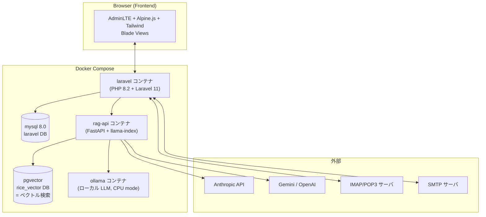
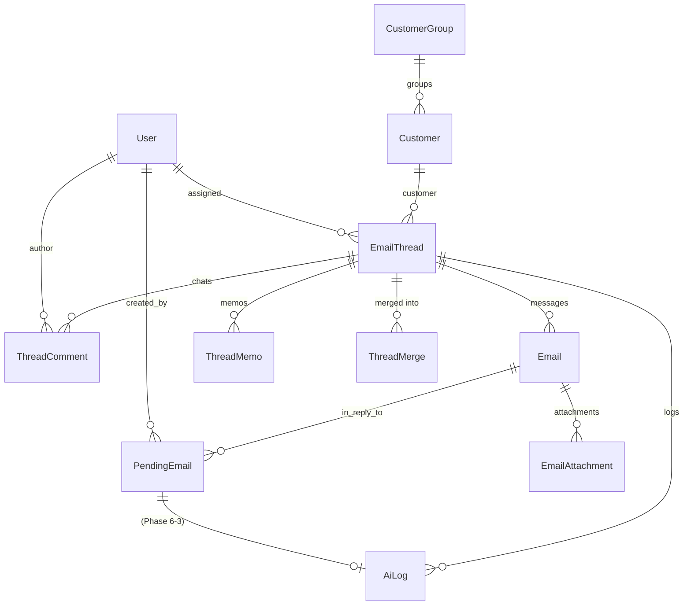
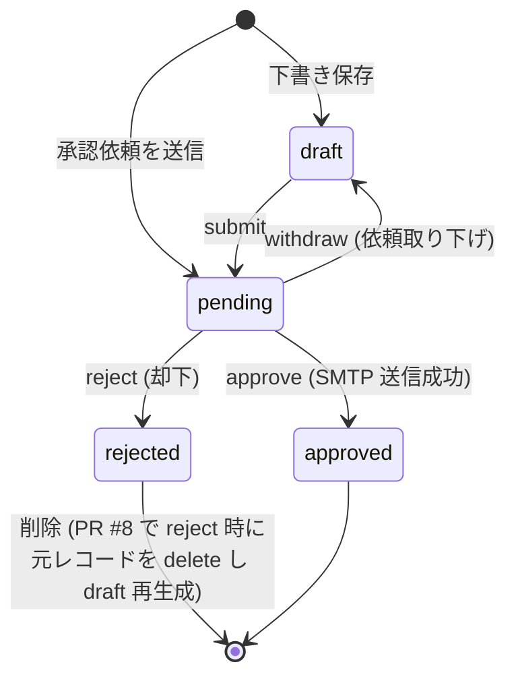
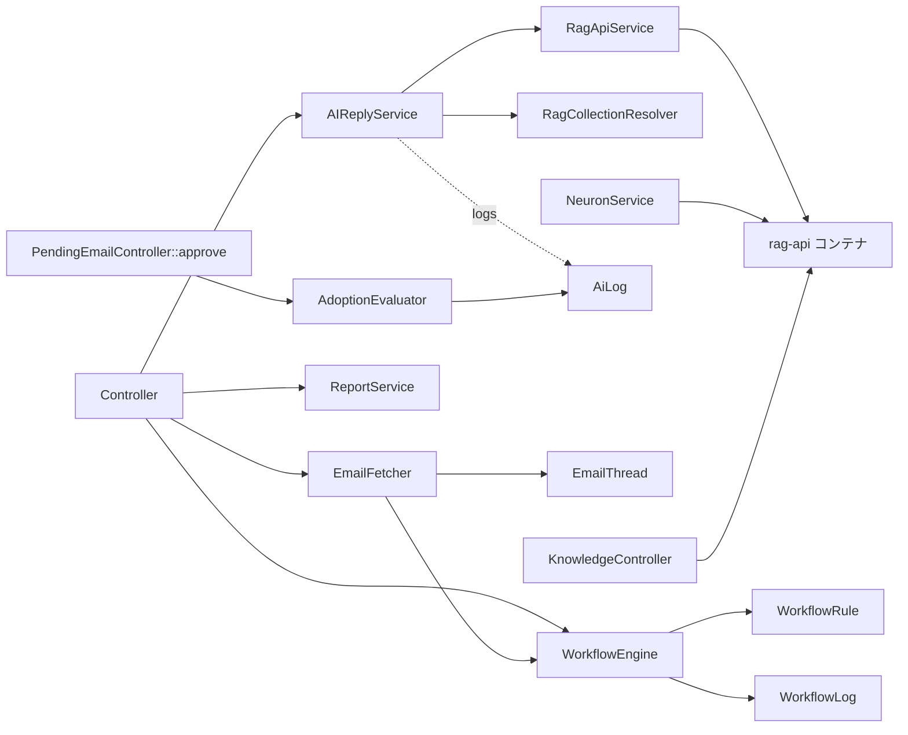
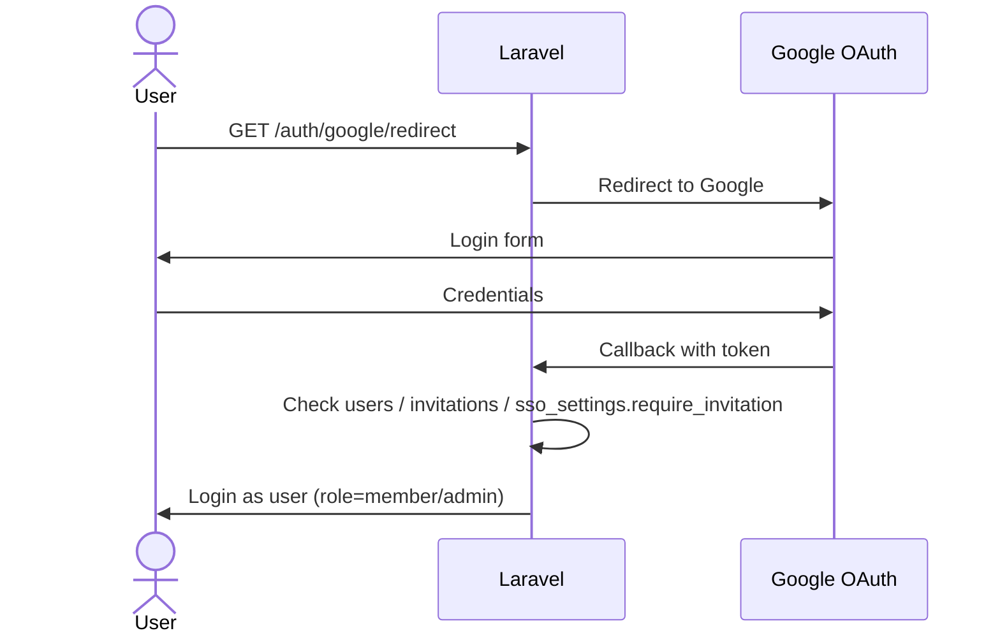

# Rice 設計書 (Design Document)

> 生成日: 2026-05-13
> 対象: `claude/drafts-sent-approvals-fixes-v2` ブランチ + Phase 6 機能群

Rice は **Laravel + FreeScout 風ベース** の社内メール対応 / AI 補助プラットフォームです。
本書はクラス・関数・データ構造・モジュール・コンテナ構成を俯瞰できるように整理した設計書です。

---

## 1. システム全体像



### 1.1 役割

| サービス | 役割 |
| --- | --- |
| **laravel** | Web UI / API / メール送受信統合 / RDB スキーマ |
| **rag-api** | FastAPI ベースの RAG (Retrieval-Augmented Generation) サービス。LLM プロバイダ (Ollama / Claude / Gemini) を切り替え |
| **ollama** | ローカル LLM 推論 (CPU モード、~6.7 GiB) |
| **mysql** | アプリケーション主データベース (`laravel`) |
| **postgres + pgvector** | ベクトル埋め込みストア (`rice_vector`) — RAG 用 |

### 1.2 主要技術スタック

| レイヤー | 採用技術 |
| --- | --- |
| Web フレームワーク | Laravel 11 |
| Frontend テンプレート | Blade + AdminLTE 3.2 + Alpine.js 3.x + Tailwind (CDN 経由) |
| グラフ | Chart.js 4.x (AI 統計レポート) |
| 認証 | Laravel Breeze + Socialite (Google OAuth) + 招待制 |
| メール | webklex/php-imap (受信), Laravel Mail (送信) |
| RAG | llama-index + pgvector |
| LLM | Ollama (default) / Anthropic Claude / Google Gemini |
| キュー | database driver (FetchEmailsJob / ProcessChatQuery) |
| テスト | PHPUnit + Playwright (GUI) |

---

## 2. ディレクトリ構成 (主要部のみ)

```
Rice/
├── docker-compose.yml          # 5 サービス + 4 volumes + 1 network
├── Makefile                    # make test-unit / test-feature / test-phase6 / test-all
├── laravel/                    # Laravel 11 アプリ本体
│   ├── app/
│   │   ├── Http/Controllers/   # 22 個のコントローラ (Mail / Approval / Customer / etc.)
│   │   ├── Models/             # 20 個のモデル (User / Email / EmailThread / PendingEmail / etc.)
│   │   ├── Notifications/      # ApprovalRequested / Rejected / ChatMention の 3 種
│   │   ├── Jobs/               # FetchEmailsJob / ProcessChatQuery
│   │   ├── Services/           # RagApiService (rag-api クライアント)
│   │   └── Support/            # SignatureSanitizer (HTML 署名のサニタイザ)
│   ├── Modules/                # FreeScout 風モジュール (機能単位で疎結合)
│   │   ├── MailClient/         # IMAP fetch / SMTP send
│   │   ├── Workflow/           # レポート / 自動割当ルール
│   │   ├── Knowledge/          # ナレッジ取り込み (rag-api プロキシ)
│   │   ├── AIReply/            # AI 返信生成 / コレクション解決 / 採用率算定
│   │   └── OAuthLogin/         # Google OAuth ログイン
│   ├── database/migrations/    # 46 個のマイグレーション (Phase 0〜6)
│   ├── resources/views/        # Blade テンプレート (emails / chats / approvals / etc.)
│   ├── routes/web.php          # 100+ ルート
│   └── tests/                  # Unit / Feature / Integration / Phase2 / Phase6
├── rag-python/                 # FastAPI ベースの RAG サービス
│   ├── main.py                 # /scrape / /query / /models / /health
│   ├── rag_engine.py           # llama-index + pgvector ラッパー
│   ├── scraper.py              # サイトクローラ (BeautifulSoup4)
│   └── document_parser.py      # ファイル → テキスト
└── backups/                    # Phase 6 ロールバック用 (.gitignore)
```

---

## 3. データモデル (主要 14 テーブル)

### 3.1 ER 図 (主要 entity のみ)



### 3.2 主要テーブル

#### `users`
| カラム | 型 | 用途 |
| --- | --- | --- |
| id | bigint | PK |
| name, email, password | string | 基本 |
| role | string | `admin` or `member` (`isAdmin()` 判定) |
| **signature_text / signature_html / signature_enabled** | text / longtext / bool | **Phase 6-4** Agent 別署名 |

#### `email_threads` (受信トレイ単位の会話)
| カラム | 用途 |
| --- | --- |
| id, subject, last_email_at | 基本 |
| customer_id | 紐付く Customer |
| status | `inbox` / `hold` / `completed` / `pending` / `no_action` |
| tags | JSON 配列 |
| is_pinned, assigned_user_id | UI 機能 |
| ticket_number | `RICE-000123` 形式の自動採番 (PR #4) |

#### `emails` (個別メールメッセージ)
| カラム | 用途 |
| --- | --- |
| thread_id (FK), message_id (unique), in_reply_to | スレッド復元の鍵 |
| subject / from / to / cc / bcc / body_text / body_html | 内容 |
| received_at | 受信時刻 (送信メールには `SENT_<ts>` 形式の message_id) |

#### `pending_emails` (承認待ち / 下書き / 却下済 / 送信済)
| カラム | 用途 |
| --- | --- |
| status | `draft` / `pending` / `approved` / `rejected` (Phase 5 で導入) |
| in_reply_to_email_id, reply_type (compose/reply/reply_all) | 送信タイプ |
| to_address / cc / bcc / subject / body | 内容 |
| attachment_paths | JSON (path/filename/mime_type/size の配列) |
| created_by_user_id / approved_by_user_id / rejected_by_user_id / target_approver_user_id | 関係 user |
| approved_at / rejected_at / rejection_reason | 履歴 |
| memo, source_rejected_id | 却下→下書き再生成のリンク (PR #8) |
| **ai_log_id** | **Phase 6-3** 採用率算定で参照 |

#### `customers`
| カラム | 用途 |
| --- | --- |
| name / email / domain / notes | 基本 |
| group_id (FK CustomerGroup) / sort_order | UI 整列 |
| **rag_collection** | **Phase 6-1** AI 参照する RAG コレクション名 |

#### `ext_ai_logs` (AI 返信生成ログ)
| カラム | 用途 |
| --- | --- |
| email_thread_id, user_id | 紐付き |
| provider | `ollama` / `claude` / `gemini` |
| prompt_summary, generated_reply, confidence_score | 生成内容 |
| safety_checks | JSON |
| **collection** | **Phase 6-1** 利用 RAG コレクション |
| **pending_email_id, was_adopted, edit_distance, sent_at** | **Phase 6-3** 採用率算定 |

#### `ext_workflow_rules` (自動割当ルール)
| カラム | 用途 |
| --- | --- |
| name | ラベル |
| condition_type / condition_operator / condition_value / actions | 旧来のルール (Phase 5) |
| **match_type / match_value / assign_user_id** | **Phase 6-2** 新ルール |
| priority, is_active | 評価順、有効/無効 |

#### `ext_workflow_logs` (Phase 6-2)
| カラム | 用途 |
| --- | --- |
| thread_id, assigned_user_id, rule_id | 紐付き |
| assigned_by | `rule` / `round_robin` / `manual` |
| created_at | 履歴 |

#### `ext_workflow_round_robin`
- ラウンドロビン担当者の `last_assigned_user_id` を 1 行で保持

#### `ai_settings`
| カラム | 用途 |
| --- | --- |
| anthropic_api_key / gemini_api_key | 暗号化保存 (Crypt) |
| default_provider, default_model | 既定 LLM |
| **default_collection** | **Phase 6-1** 既定コレクション |
| default_reply_prompt | AI スキル既定プロンプト |
| agent_name, agent_signature | グローバル署名 (フォールバック用) |

#### その他主要テーブル
- `mail_settings` — SMTP/IMAP/POP 設定
- `sso_settings` — Google OAuth クライアント情報
- `invitations` — 招待トークン
- `tags`, `tag_notes`, `status_masters` — マスター類
- `thread_memos` — スレッド内メモ
- `thread_comments` — スレッド内チャット (社内 @メンション対応)
- `thread_merges` — スレッドマージ履歴
- `documents`, `scraped_urls` — ナレッジ素材
- `chat_queries` — Rice Chat の質問ログ (キュー処理)
- `notifications` — Laravel 標準 (database channel)

---

## 4. モデル層

### 4.1 主要モデルとリレーション

| Model | 主要メソッド・スコープ |
| --- | --- |
| **User** | `isAdmin()`, **`effectiveSignature(): array{type, content}`** (Phase 6-4) |
| **EmailThread** | static `generateTicketNumber(int)`, `extractTicketNumber(string)`, `ensureTicketInSubject(string,string)`, `ensureTicketNumber()`, リレーション `customer/assignee/emails/latestEmail/threadMerges/threadMemos/threadComments` |
| **Email** | `thread()`, `attachments()`, accessor `from_label`, `plain_body` |
| **PendingEmail** | const `STATUS_DRAFT/PENDING/APPROVED/REJECTED`, リレーション `inReplyToEmail/creator/approver/rejecter/targetApprover/aiLog`, accessor `reply_type_label`, `body_preview` |
| **AiLog** (Phase 6-3) | `user()/thread()/pendingEmail()` リレーション, `adopted()/discarded()` スコープ |
| **Customer** | `group()/emailThreads()` リレーション |
| **AiSetting** | static `getSettings()` (シングルトン), API キーは Crypt 暗号化 mutator |
| **WorkflowRule** (Phase 6-2) | const `MATCH_FROM_ADDRESS/FROM_DOMAIN/SUBJECT_CONTAINS/TO_ADDRESS`, `active()/byPriority()` スコープ, `assignee()` |
| **WorkflowLog** (Phase 6-2) | const `ASSIGNED_BY_RULE/ROUND_ROBIN/MANUAL` |

### 4.2 ステータス遷移 (PendingEmail)



---

## 5. コントローラ層

### 5.1 コントローラ一覧と責務

| Controller | 主な責務 | 主要メソッド |
| --- | --- | --- |
| **EmailController** | メール一覧 / 個別スレッド / 返信送信 / AI 返信生成 | `index/pinned/composeWindow/replyWindow/fetch/askAi/askAiCompose/summarizeThread/reply/compose/search/togglePin/updateAssignee/users/thread/updateStatus/deleteThread/updateTags/bulkAssignCustomer` |
| **PendingEmailController** | 承認待ち一覧 / 承認 / 却下 / 取り下げ | `index/approve/withdraw/reject` + private `appendSignature/normalizeAttachment/humanSize/applySmtpConfig` |
| **ApprovalController** | `/approvals` ページ (Blade のみ。データ取得は PendingEmailController) | `index()` |
| **DraftController** | 下書き一覧 / 編集 / 送信 / 削除 | `index/list/submit/edit/destroy` |
| **AttachmentController** | 添付一覧 / ダウンロード | `index/download` |
| **CustomerController** | 顧客 CRUD + メール紐付け | `index/store/update/assign/data/reorder/moveToGroup/destroy` |
| **CustomerGroupController** | 顧客グループ CRUD | 同上 |
| **TagController / TagNoteController / MasterTagController / StatusMasterController** | タグ・ステータスマスター |  |
| **ThreadChatController** | スレッド内チャット一覧 (`/chats`) | `index/listThreads` |
| **ThreadCommentController** | スレッド個別のチャット投稿 (mention 通知連動) | `index/store/destroy` |
| **ThreadMemoController** | スレッド個別メモ | `index/store` |
| **ThreadMergeController** | スレッド統合 | `merge/unmerge` |
| **ChatController** | Rice Chat (RAG への問合せ画面) | `index/models/query/result` |
| **DocumentController** | ナレッジドキュメント | `index/store/destroy` |
| **ScrapeController** | サイトクローリング | `index/store/destroyUrl/destroy` |
| **SettingsController** | メール/AI/SSO 設定 (admin 限定の一部) | `mail/updateMail/ai/updateAi/sso/updateSso/getDefaultPrompt/saveDefaultPrompt` |
| **ProfileController** | 自分のプロフィール編集 | `edit/update/destroy` (Phase 6-4 で signature_* フィールド対応) |
| **Admin/InvitationController** | 招待管理 (admin) | `index/store/destroy` |
| **Auth/SocialiteController** | Google OAuth | `redirect/callback` |
| **InvitationAcceptController** | 招待受諾フロー | `show/store` |
| **(Phase 6-2) Modules\Workflow\WorkflowRuleController** | 自動割当ルール CRUD (admin) | `index/list/store/update/destroy/toggle` |
| **(Phase 6-1) Modules\Knowledge\KnowledgeController** | ナレッジ + RAG コレクション一覧 | `index/crawl/collections` |
| **Modules\AIReply\AIReplyController** | AI 返信生成 (一括) | `generate(EmailThread, AIReplyService)` |
| **Modules\Workflow\ReportController** | レポート画面 + AI 統計 API | `index(Request, ReportService)`, `aiUsage(Request, ReportService)` |

### 5.2 ルート命名規約

- リソース型: `route('emails.index')` / `route('pending.approve')` 等
- API 型: `/api/...` 接頭辞 (例: `GET /api/knowledge/collections`)
- 管理者専用: `Route::middleware('admin')` グループ内 (`/admin/*`, `/settings/*`, `/master/*`)

---

## 6. サービス層 (`app/Services/` + `Modules/*/Services/`)

| Service | 役割 | 主要メソッド |
| --- | --- | --- |
| **`App\Services\RagApiService`** | rag-api サービスへの HTTP クライアント | `query(question, top_k, provider, model, collection)`, `getModels()`, `scrape(url, collection)`, `health()`, `deleteSource(url, collection)`, `deleteCollection(collection)` |
| **`Modules\MailClient\Services\EmailFetcher`** | IMAP/POP3 からメール取得・スレッド解決 | `fetch(): int`, `resolveThread(subject, in_reply_to, from)`, protected `findOrCreateThread(message)`, `handleAttachments(message, email)` |
| **`Modules\MailClient\Services\EmailSender`** | 旧 SMTP 送信 (現在は `PendingEmailController::approve` が主) | `send(threadId, data)` |
| **`Modules\Workflow\Services\WorkflowEngine`** | ワークフロー実行 (タグ付け + 自動割当) | `process(thread, email)` (旧), **`assignByRule(thread): ?User`**, **`assignByRoundRobin(thread): ?User`**, **`autoAssign(thread): void`**, **`matches(rule, email): bool`** (Phase 6-2) |
| **`Modules\Workflow\Services\ReportService`** | 集計・統計 | `getSummary(filters)`, 内部 `getTotals/getStatsByAssignee/getStatsByDate/getStatsByTag/getStatsByStatus`, **Phase 6-3: `aiUsageStats/aiUsageByUser/aiUsageByCollection/aiUsageByDay/aiConfidenceHistogram`** |
| **`Modules\Knowledge\Services\NeuronService`** | rag-api `/scrape`/`/query` への薄いラッパー | `startCrawl(url, depth)`, `query(text)` |
| **`Modules\AIReply\Services\AIReplyService`** | AI 返信ドラフト生成 | `generate(thread)` 内部で RagCollectionResolver→RagApiService→logGeneration |
| **`Modules\AIReply\Services\RagCollectionResolver`** (Phase 6-1) | スレッド → コレクション解決 | `resolve(thread): string` (customer→domain→from_domain→default の優先順) |
| **`Modules\AIReply\Services\AdoptionEvaluator`** (Phase 6-3) | 採用率算定 (Levenshtein) | `evaluate(pending): void` (`was_adopted`/`edit_distance`/`sent_at` を書き込む) |

### 6.1 サービス依存図



---

## 7. モジュール構成 (FreeScout 風)

### 7.1 `Modules\MailClient` (受送信)
```
MailClient/
├── Console/Commands/FetchEmailsCommand.php   # artisan mail:fetch
├── Providers/MailClientServiceProvider.php
└── Services/
    ├── EmailFetcher.php                       # IMAP/POP3 from settings
    └── EmailSender.php                        # 旧 SMTP send
```
- **EmailFetcher::fetch()**: 50 通ごと取得 → message_id で重複検出 → resolveThread → Email::create → 添付保存 → **autoAssign (新規スレッドのみ)**
- **チケット番号**: `EmailThread::extractTicketNumber()` で件名 `[RICE-000123]` を抽出 → 既存スレッドにマージ。なければ新規 thread + `ensureTicketNumber()`

### 7.2 `Modules\Workflow` (集計 + 自動割当)
```
Workflow/
├── Database/Migrations/2026_04_27_000001_create_workflow_tables.php
├── Http/Controllers/
│   ├── ReportController.php                  # /reports + /reports/ai-usage
│   └── WorkflowRuleController.php            # /admin/workflow-rules (Phase 6-2)
├── Models/
│   ├── WorkflowRule.php                      # Phase 6-2
│   └── WorkflowLog.php                       # Phase 6-2
├── Providers/WorkflowServiceProvider.php
├── Resources/views/
│   ├── dashboard.blade.php                   # レポートトップ + Phase 6-3 AI 統計
│   └── rules/index.blade.php                 # Phase 6-2 ルール CRUD UI
└── Services/
    ├── ReportService.php
    └── WorkflowEngine.php
```

### 7.3 `Modules\AIReply` (RAG ベース AI 返信)
```
AIReply/
├── Database/Migrations/2026_04_27_000002_create_ai_logs_table.php
├── Http/Controllers/AIReplyController.php    # POST /threads/{thread}/ai-generate
├── Providers/AIReplyServiceProvider.php
└── Services/
    ├── AIReplyService.php
    ├── RagCollectionResolver.php             # Phase 6-1
    └── AdoptionEvaluator.php                 # Phase 6-3
```

### 7.4 `Modules\Knowledge` (RAG ナレッジ)
```
Knowledge/
├── Http/Controllers/KnowledgeController.php  # /knowledge + /api/knowledge/collections (Phase 6-1)
├── Providers/KnowledgeServiceProvider.php
├── Resources/views/index.blade.php
└── Services/NeuronService.php                # rag-api への薄いラッパー
```

### 7.5 `Modules\OAuthLogin` (Google ログイン)
```
OAuthLogin/
├── Http/Controllers/OAuthController.php
├── Providers/OAuthLoginServiceProvider.php
└── routes.php
```

---

## 8. Notifications (Laravel database channel)

| Notification | 発火タイミング | data ペイロード |
| --- | --- | --- |
| **ApprovalRequestedNotification** | `pending.status=pending` 作成時 (notifyAdmins) | `pending_id`, `subject`, `to_address`, `created_by`, `reply_type` |
| **RejectedNotification** | `pending.reject()` 後、created_by へ送信 | `pending_id`, `subject`, `rejection_reason`, `rejecter_name`, `kind: 'rejected'` |
| **ChatMentionNotification** | `ThreadComment::store` で `@ユーザ名` マッチ時 | `kind: 'chat_mention'`, `thread_id`, `thread_subject`, `comment_id`, `mentioner` |

UI 側 (`layouts/app.blade.php` のベルアイコン) は `kind` を見て表示・遷移先を分岐:
- `chat_mention` → `/chats#thread-<id>&comment=<cid>`
- `rejected` → `/drafts`
- それ以外 (`approval`) → `/approvals`

---

## 9. ジョブ (キュー)

| Job | 役割 |
| --- | --- |
| **`FetchEmailsJob`** | 定期的に IMAP fetch を実行 (queue:work 経由) |
| **`ProcessChatQuery`** | Rice Chat の質問を非同期で RAG API に投げ、`chat_queries` を更新 |

---

## 10. ビュー層 (Blade)

### 10.1 主なページ
| URL | View | 説明 |
| --- | --- | --- |
| `/` | `emails/index.blade.php` | メール一覧 (3 カラム: ナビ / スレッド / ワークスペース) |
| `/?thread=N` | 同上 | init() 内で `?thread=` を解釈してスレッド自動オープン (PR #8) |
| `/chats` | `chats/index.blade.php` | チャット一覧 (左: スレッド / 右: チャット) |
| `/approvals` | `approvals/index.blade.php` | 承認・送信統合画面 (Phase 5 改修 + PR #8) |
| `/drafts` | `drafts/index.blade.php` | 下書き一覧 |
| `/attachments` | `attachments/index.blade.php` | 添付ファイル横断検索 |
| `/reports` | `Modules/Workflow/Resources/views/dashboard.blade.php` | レポート (+ Phase 6-3 AI 統計セクション) |
| `/admin/workflow-rules` | `Modules/Workflow/Resources/views/rules/index.blade.php` | 自動割当ルール (Phase 6-2) |
| `/profile` | `profile/edit.blade.php` (+ `partials/signature-form.blade.php`) | 自分の設定 (Phase 6-4 で署名追加) |
| `/settings/{mail,ai,sso}` | `settings/*.blade.php` | 管理者設定 |
| `/emails/compose-window`, `/emails/{email}/reply-window` | `emails/compose-window.blade.php` | 作成専用ウィンドウ (新規/返信/全員返信、下書き再編集) |

### 10.2 共通レイアウト
- **`layouts/app.blade.php`** — AdminLTE ベース。ヘッダ通知ベル + ユーザメニュー + 左サイドバー
- **`layouts/fullpage.blade.php`** — compose-window 用 (サイドバー無し)
- **`components/app-layout.blade.php`** — Tailwind ベースの代替レイアウト (一部画面で利用)

### 10.3 サイドバー構成 (admin 視点)
```
メール
├─ メール一覧
├─ 下書き
├─ 承認・送信
├─ 添付ファイル
└─ チャット一覧
AI
├─ Rice Chat
├─ スクレイプ
└─ ドキュメント
レポート
ナレッジベース
─ ADMIN ─
├─ 招待管理
├─ 割当ルール  (Phase 6-2)
├─ メール設定
├─ AI設定
├─ SSO設定
├─ ステータスマスタ
└─ タグマスタ
```

---

## 11. ルート設計 (`routes/web.php` 約 100 ルート)

### 11.1 グループ
1. **公開**: `/auth/{provider}/{redirect,callback}`, `/invitations/accept/{token}`
2. **`middleware(['auth','verified'])`**: 全アプリ機能
3. **`middleware('admin')`** (上記内に nested): `/admin/*`, `/settings/{mail,ai,sso}`, `/master/*`, `/admin/workflow-rules/*`

### 11.2 命名規約
- ページ: `emails.index`, `chats.index`
- リソース API: `customers.store/update/destroy`
- 個別動作: `threads.merge`, `pending.approve`, `drafts.submit`, `admin.workflow-rules.toggle`

---

## 12. 認証・権限



- **3 つのログイン方式**:
  1. Email + Password (Breeze)
  2. Google OAuth (Socialite, `sso_settings.is_enabled` でトグル)
  3. 招待トークン (`/invitations/accept/{token}` で初回登録)

- **権限**: `users.role = 'admin' | 'member'`, `User::isAdmin()` ヘルパー
- **admin only ルート**: `Route::middleware('admin')` (HandleInertia 風の独自ミドルウェア)

---

## 13. RAG / AI 連携 (`rag-python`)

### 13.1 ファイル構成
| ファイル | 役割 |
| --- | --- |
| `main.py` | FastAPI エントリ。エンドポイント定義 |
| `rag_engine.py` | llama-index + pgvector ラッパー (`RAGEngine.query/add_documents`) |
| `scraper.py` | サイトクローラ (Beautiful Soup 4) |
| `document_parser.py` | PDF / Word 等のテキスト化 |
| `requirements.txt` | fastapi, uvicorn, llama-index, llama-index-vector-stores-postgres, psycopg2, anthropic, google-generativeai, beautifulsoup4 |

### 13.2 API
| Method | Path | 用途 |
| --- | --- | --- |
| POST | `/scrape` | URL クロール (background task) |
| POST | `/query` | RAG クエリ (Laravel 側から `collection` 指定可) |
| GET | `/models` | プロバイダ別利用可能モデル一覧 |
| GET | `/health` | ヘルスチェック |
| GET | `/collections` | (Phase 6-1 が期待。未実装なら Laravel 側がフォールバック) |

### 13.3 LLM プロバイダ切替
- 環境変数 `LLM_PROVIDER`: `ollama` (default) / `claude` / `gemini`
- Anthropic / Gemini の場合は Laravel 側で `ai_settings.anthropic_api_key` / `gemini_api_key` を Crypt 復号して payload で渡す

---

## 14. Phase 別の主要差分 (履歴)

| Phase | 内容 | 主要変更 |
| --- | --- | --- |
| **0-2** | FreeScout 風基盤 | users / threads / emails / mail_settings |
| **3** | 顧客 + タグ | customers, customer_groups, tags |
| **4** | 承認ワークフロー | pending_emails, ext_workflow_rules, ext_ai_logs |
| **5** | AI 返信 + 招待 + 通知 | AIReply モジュール, RejectedNotification, role/invitations |
| **PR #4** | RAG `?query` フィールド名修正、添付/チャット → メール本文遷移 | |
| **PR #6** | 完了押下時に未アサインなら担当者自動セット | |
| **PR #7** | スレッドステータス `no_action`「対応不要」追加 | EmailThread STATUSES |
| **PR #8** | 下書き保存 → メール一覧 / 送信済メニュー / 承認画面レイアウト修正 / 却下=下書き再生成 / ChatMentionNotification / リサイズ可能パネル / 添付引継ぎ修正 / 等 大規模 UX 改善 | drafts/sent/approvals views, AI Provider 連携 |
| **Phase 6-1** | 顧客別 RAG コレクション | `customers.rag_collection`, `ai_settings.default_collection`, `RagCollectionResolver` |
| **Phase 6-2** | 送信元別自動割当 | `ext_workflow_rules.match_type/value/assign_user_id`, `ext_workflow_logs`, `WorkflowEngine::autoAssign` |
| **Phase 6-3** | AI 採用率レポート | `ext_ai_logs.was_adopted/edit_distance/sent_at`, `AdoptionEvaluator`, `/reports/ai-usage`, Chart.js |
| **Phase 6-4** | Agent 別署名 | `users.signature_text/html/enabled`, `User::effectiveSignature()`, `SignatureSanitizer`, `PendingEmailController::appendSignature` |

---

## 15. テスト体系

### 15.1 構成
```
laravel/tests/
├── Feature/
│   ├── ExampleTest.php
│   ├── Phase2Test.php                       # Phase 2 回帰
│   └── Phase6/
│       ├── RagCollectionTest.php
│       ├── WorkflowAutoAssignTest.php
│       ├── AiUsageReportTest.php
│       └── UserSignatureFeatureTest.php
└── Unit/
    ├── ExampleTest.php
    ├── RagCollectionResolverTest.php
    ├── AdoptionEvaluatorTest.php
    ├── WorkflowRuleMatchTest.php
    └── UserSignatureTest.php
```

### 15.2 Makefile ターゲット
```bash
make test-unit          # tests/Unit/
make test-feature       # tests/Feature/
make test-gui           # tests/gui/ (Playwright)
make test-integration   # @group integration
make test-phase6        # Phase 6 関連のみ
make test-all           # 上記全部
```

---

## 16. デプロイ・運用観点

### 16.1 マイグレーション順序
```
0001  → users / cache / jobs / notifications
2024  → email_threads / emails / documents / mail_settings / scraped_urls /
        chat_queries / ai_settings / pending_emails / email_attachments /
        tag_notes / thread_merges
2026  → customers / status / tags / thread_memos / thread_comments /
        sso / role / invitations / pin / from_address / ticket_number /
        rejection_reason / target_approver / source_rejected_id (PR #8) /
        Phase 6: rag_collection / default_collection / workflow_rules ext /
        workflow_logs / ext_ai_logs ext / pending_emails.ai_log_id /
        users signature
```

### 16.2 バックアップ
- `backups/phase6-YYYYMMDD/` (.gitignore)
- `backup.sh`: MySQL `laravel` (root/rootsecret) + PostgreSQL `rice_vector` (rice/rice_secret) + Docker volume tar.gz
- ロールバック: `git checkout pre-phase6-YYYYMMDD` + `backup.sh` の逆操作 (RESTORE.md 参照)

### 16.3 既知の問題
- WSL 環境で `node_modules/.bin/*` 等の symlink が "Function not implemented" を返す → `git checkout` 時に出る程度で動作に影響なし
- Ollama は GPU なしの場合 NVIDIA 予約ブロックをコメントアウトする (`docker-compose.yml` 53 行目付近)
- PHP バージョン: ローカル 7.4 では composer install 不可。`docker compose exec laravel php ...` 推奨

---

## 17. 拡張ポイント

| 拡張 | アプローチ |
| --- | --- |
| 別の LLM プロバイダ追加 | `rag-python/rag_engine.py` の `LLM_PROVIDER` 分岐 + Laravel `RagApiService::query` に key を追加 |
| 別の自動割当ルール (例: ML 分類) | `Modules\Workflow\WorkflowEngine::assignByRule()` に分岐 (新 `match_type` を WorkflowRule::MATCH_TYPES に追加) |
| 採用判定のしきい値変更 | `Modules\AIReply\AdoptionEvaluator::ADOPTION_THRESHOLD` (現在 0.1 = 10%) |
| 新スレッドステータス追加 | `EmailThread::STATUSES` + `updateStatus` バリデーション + UI のタブ追加 |
| 新通知種別 | `app/Notifications/*` + `layouts/app.blade.php` の `bellIcon/bellTitle/bellSubtitle/bellLinkFor` に分岐 |

---

## 18. 用語集

| 用語 | 説明 |
| --- | --- |
| **Thread** | 1 連の会話 (受信スレッド)。`email_threads` |
| **Email** | 個別のメッセージ。受信メールと送信完了メール (`message_id="SENT_..."`) の両方 |
| **PendingEmail** | 送信予約 (承認待ち / 下書き / 却下済 / 送信済) |
| **Ticket Number** | `RICE-000123` 形式のスレッド永続 ID。件名に埋め込み、受信時にスレッド復元の鍵 |
| **Collection** | RAG のドキュメント集合の論理単位 (`mf_faq` 等) |
| **Adopted (採用)** | AI 生成案が SMTP 送信時にほぼそのまま使われた (`edit_distance/max_len <= 10%`) |
| **Round Robin (RR)** | 担当者を順番に均等割当する方式。`ext_workflow_round_robin` で前回 ID を保持 |

---

このドキュメントは [`git log --oneline -20`] や [`grep`] でアップデートできる構造にしてあります。Phase 6 以降の追加機能では、本書の対応セクション (4 = モデル, 5 = コントローラ, 6 = サービス, 7 = モジュール, 11 = ルート, 15 = テスト, 17 = 拡張ポイント) に追記する形で運用してください。
